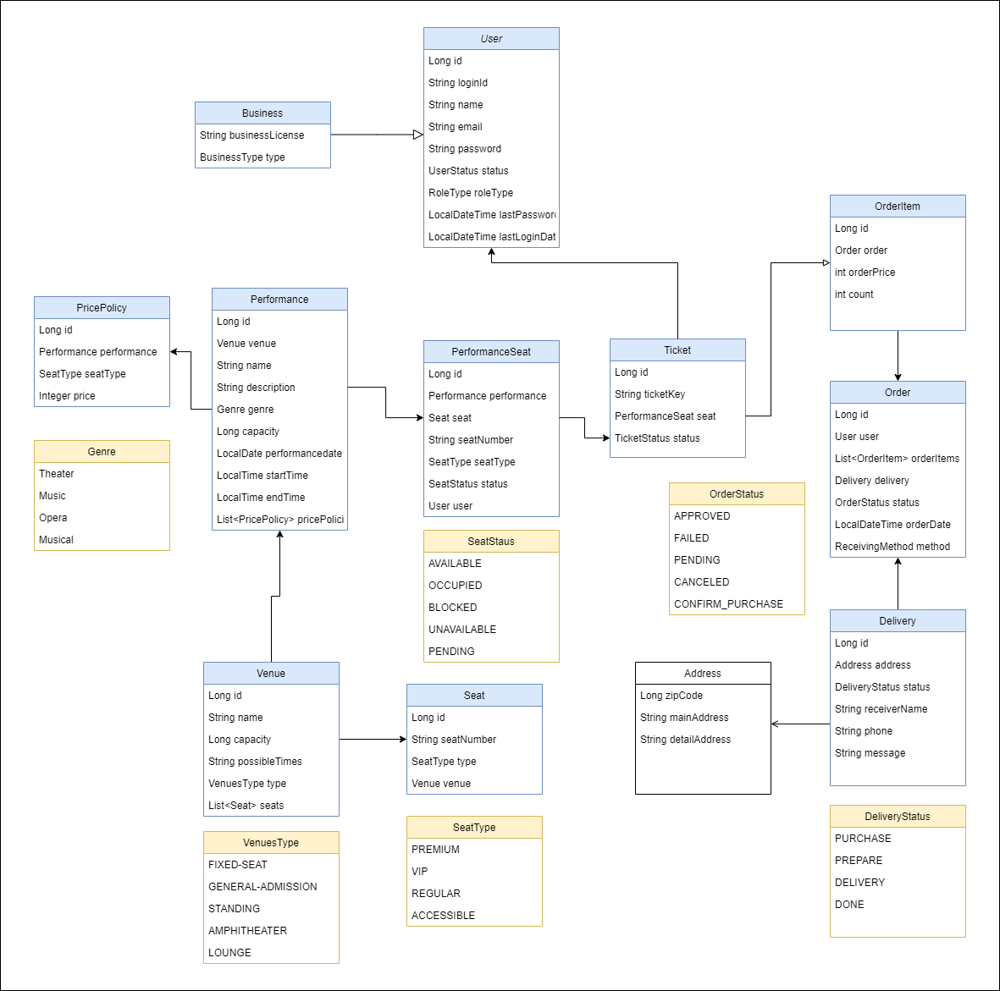

# 공연 예약/결제 시스템 

- [🚙 도메인 다이어그램](#-도메인-다이어그램)
- [🚌 도메인](#-도메인)
  - [☁ User](#-User)
  - [☁ Business](#-Business)
  - [☁ Venue](#-Venue)
  - [☁ Seat](#-Seat)
  - [☁ Performance](#-Performance)
  - [☁ PricePolicy](#-PricePolicy)
  - [☁ PerformanceSeat](#-PerformanceSeat)
  - [☁ Order](#-Order)
  - [☁ OrderItem](#-OrderItem)
  - [☁ Ticket](#-Ticket)
  - [☁ Delivery](#-Delivery)
- [🚗 패키지 구조](#-패키지-구조)
  - [☁ common: 공통 패키지](#-common--공통-패키지)
  - [☁ web: 웹 관련 패키지](#-web--웹-관련-패키지)
  - [☁ 도메인 별 패키지 규칙](#-도메인-별-패키지-규칙)
- [🚓 모듈 설명](#-모듈-설명)
  - [☁ Security](#-Security)
  - [☁ RoleCheck](#-RoleCheck)
  - [☁ Querydsl](#-Querydsl)
  - [☁ Swagger](#-Swagger)
  - [☁ Test](#-Test)
- [🚕 라이브러리](#-라이브러리)


<br/><br/>

---
---

<br/>

## 🚙 도메인 다이어그램


--- 

<br/>

## 🚌 도메인

### ☁ User
- 사용자
- 단일 테이블 전략 (`InheritanceType.SINGLE_TABLE`)

### ☁ Business
- 사업계정
- `User` 도메인을 상속받는다.

### ☁ Venue
- 공연장

### ☁ Seat
- 좌석 (공연장 default 좌석)

### ☁ Performance
- 공연

### ☁ PricePolicy
- 공연 가격 정책
- 공연 별로 좌석에 대한 가격 정책이 달라 `Performance`와 연관관계를 갖고 있다.

### ☁ PerformanceSeat
- 공연 좌석
- 공연에 따라 좌석 사용용도도 다르고 공연별로 좌석 예매되는 형태로 `Performance`와 연관관계를 갖고 있다.

### ☁ Order
- 주문

### ☁ OrderItem
- 주문 상품
- 단일 테이블 전략 (`InheritanceType.SINGLE_TABLE`)
  - 추후 티켓뿐만 아니라 일반 상품 구매하는 것도 고려하여 상속관계로 만들었다.

### ☁ Ticket
- 티켓 도메인
- `OrderItem` 도메인을 상속받는다.

### ☁ Delivery
- 배송 도메인


---

<br/>

## 🚗 패키지 구조

### ☁ common: 공통 패키지
- 💧 base: Domain Entity의 Base Class
- 💧 config: Configuration Class
- 💧 type: Enum
- 💧 util: Util Class

### ☁ web: 웹 관련 패키지
- 💧 aop: AOP
- 💧 api: API
- 💧 config: Web Configuration Class
- 💧 exception: Exception
- 💧 security: Spring Security

### ☁ 도메인 별 패키지 규칙
- 💧 annotation: Annotation
- 💧 domain: Entity
- 💧 exception: Exception
- 💧 repository: Repository
- 💧 service: Service
- 💧 type: Enum
- 💧 value: DTO, VO


---

<br/>

## 🚓 모듈 설명
### ☁ Security
> Swagger 화면, 회원 가입, 로그인 외 Filter 적용
> 
> JWT 으로 인증, 인가 처리
>

- **Core 설정 클래스** : SecurityConfig
- **인증 Filter** : JwtAuthenticationFilter
- **인가 Filter** : JwtAuthorizationFilter
- **토큰 Provider** : JwtTokenProvider
- **로그인 성공 Handler** : CustomSavedRequestAwareAuthenticationSuccessHandler
- **로그인 실패 Handler** : CustomSimpleUrlAuthenticationFailureHandler
- **Request 유저 정보 Util** : SecurityUtil


<br/>

### ☁ RoleCheck
> 권한 체크하려는 메소드에 @RoleCheck 선언
> 
> * value: 권한 (ADMIN, BUSINESS, MEMBER)
>   * default: MEMBER
>

``` JAVA
    @RoleCheck(RoleType.ADMIN)
    public Page<OrderListVo> findAllByAdmin(Pageable pageable, @Validated(AdminUser.class) OrderFindDto dto) {
        return orderService.findAll(pageable, dto);
    }
```

<br/>

### ☁ Querydsl
> Querydsl Repository는 Class로 생성하고 JPAQueryFactory를 주입받아 사용한다.

``` java
@Repository
@RequiredArgsConstructor
public class PerformanceSeatQuerydslRepository {
    private final JPAQueryFactory queryFactory;

    public List<SeatListVo> findAvailableSeats(Long performanceId) {
        return queryFactory
                .select(
                        Projections.fields(
                                SeatListVo.class,
                                performanceSeat.id.as("seatId"),
                                performanceSeat.seatNumber,
                                performanceSeat.status
                        )
                )
                .from(performanceSeat)
                .innerJoin(performanceSeat.performance, performance)
                .where(
                        performance.id.eq(performanceId),
                        performanceSeat.status.eq(SeatStatus.AVAILABLE)
                )
                .fetch();
    }
}
```

<br/>

### ☁ Swagger
> API, DTO, VO 클래스에 Swagger 관련 어노테이션을 사용하여 프론트엔드와의 협업

#### 💧 API
``` java
    @ApiOperation("공연장 상세 조회")
    @GetMapping("/{venueId}")
    public VenueDetailVo find(@PathVariable Long venueId) {
        return venueService.find(venueId);
    }
```
#### 💧 DTO/VO
``` java
@ApiModel("공연 검색 DTO")
public class PerformanceFindDto {

    @ApiModelProperty("공연장 ID")
    private Long venueId;

    @ApiModelProperty(value = "공연 이름", notes = "공연 명칭은 255자를 넘길 수 없습니다.")
    @Size(max = 255, message = "공연 명칭은 255자를 넘길 수 없습니다.")
    private String name;

    @ApiModelProperty(value = "공연 장르", example = "MUSICAL")
    private Genre genre;

    @ApiModelProperty(value = "공연 일자 from", example = "2024-01-01")
    @DateTimeFormat(pattern = "yyyy-MM-dd")
    private LocalDate fromDate;

    @ApiModelProperty(value = "공연 일자 to", example = "2024-01-01")
    @DateTimeFormat(pattern = "yyyy-MM-dd")
    private LocalDate toDate;
}
```

<br/>

### ☁ Test
> API, Service, Repository 테스트 작성 진행
> 
> 각 테스트 클래스는 공통적으로 @BookingTest 을 이용하여 
> 테스트용 DB와 init-test-import.sql을 사용할 수 있게 만든다.
> 
> request 유저 정보가 필요한 경우, @WithUserDetails("로그인ID")를 해당 테스트 메소드에 선언한다.

---

<br/>

## 🚕 라이브러리

| 그룹 | 명칭 | 버전 | 사용목적 | 라이선스 |
| --- | --- | --- | --- | --- |
| com.fasterxml.jackson.datatype | jackson-datatype-jsr310 | 2.13.5 | Date Format Support | Apache 2.0 |
| com.github.gavlyukovskiy | p6spy-spring-boot-starter | 1.5.8 | Querydsl Log | Apache 2.0 |
| com.h2database | h2 | 2.1.214 | H2 Database | EPL 1.0 & MPL 2.0 |
| com.jayway.jsonpath | json-path | 2.7.0 | JSON | Apache 2.0 |
| com.lmax | disruptor | 3.4.4 | Log | Apache 2.0 |
| com.querydsl | querydsl-core | 5.0.0 | Querydsl | Apache 2.0 |
| com.querydsl | querydsl-jpa | 5.0.0 | Querydsl | Apache 2.0 |
| com.querydsl | querydsl-apt | 5.0.0 | Querydsl | Apache 2.0 |
| io.jsonwebtoken | jjwt | 0.9.1 | JWT 토큰 | Apache 2.0 |
| io.springfox | springfox-swagger2 | 2.9.2 | Swagger | Apache 2.0 |
| io.springfox | springfox-swagger-ui | 2.9.2 | Swagger | Apache 2.0 |
| io.swagger | swagger-models | 1.5.21 | Swagger | Apache 2.0 |
| javax.xml.bind | jaxb-api | 2.3.3 | XML Binder | CDDL 1.1 |
| mysql | mysql-connector-java | 8.0.18 | Mysql | GPL 2.0 |
| org.apache.tomcat.embed | tomcat-embed-jasper | 9.0.75 | Web서버 | Apache 2.0 |
| org.junit.jupiter | junit-jupiter-api | 5.5.2 | Test | EPL 2.0 |
| org.junit.jupiter | junit-jupiter-engine | 5.5.2 | Test | EPL 2.0 |
| org.junit.platform | junit-platform-launcher | 1.5.2 | Test | EPL 2.0 |
| org.modelmapper | modelmapper | 1.1.2 | Mapper | Apache 2.0 |
| org.projectlombok | lombok | 1.18.8 | 유틸리티 | MIT |
| org.springframework.boot | spring-boot-starter | 2.7.12 | SpringBoot 코어 | Apache 2.0 |
| org.springframework.boot | spring-boot-starter-data-jpa | 2.7.12 | JPA | Apache 2.0 |
| org.springframework.boot | spring-boot-starter-web | 2.7.12 | Web서버 | Apache 2.0 |
| org.springframework.boot | spring-boot-starter-validation | 2.7.12 | 검증로직 | Apache 2.0 |
| org.springframework.boot | spring-boot-starter-security | 2.7.12 | Spring Security | Apache 2.0 |
| org.springframework.boot | spring-boot-starter-log4j2 | 2.7.12 | Log | Apache 2.0 |
| org.springframework.boot | spring-boot-devtools | 2.7.12 | 유틸리티 | Apache 2.0 |
| org.springframework.boot | spring-boot-starter-test | 2.7.12 | Test | Apache 2.0 |
| org.springframework.security | spring-security-test | 5.7.8 | Spring Security Test | Apache 2.0 |


---
